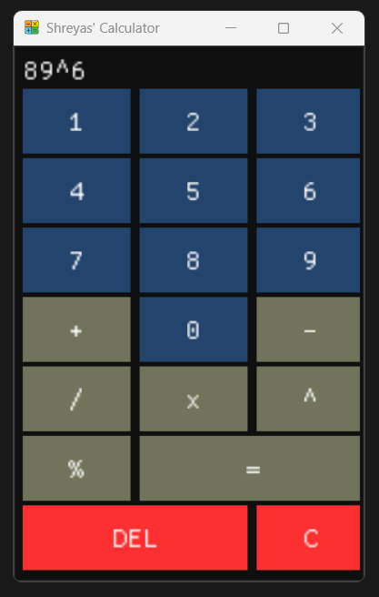

# Simple C++ Calculator with ImGui
This is a simple C++ calculator application created using ImGui. The primary goal of this project is to understand and explore the ImGui library, which is a powerful GUI toolkit for C++ applications.

## Features
* Basic arithmetic operations: Addition, Subtraction, Multiplication, Division, Modulus and Power.
* User-friendly interface with ImGui.
* Real-time calculation and result display.

1. **Executable Only (exeFile)**: Contains the compiled executable file (calculator.exe). Users can download and run this file without needing to build the source code.

2. **Source Code and Executable (Code)**: Contains the source code (Calculator.cpp, Application.cpp) along with the compiled executable (Calculator.exe). Users interested in exploring or modifying the source code can download this folder.

## How to Run
1. Executable Only
* Navigate to the "exeFile" folder.
* Download the entire folder.
* Run the Calculator.exe file.

2. Source Code and Executable
* Navigate to the "Code" folder.
* Download the entire folder.
* Optionally, explore or modify the source code in calculator.cpp.
* Run the Calculator.exe file.

## Requirements
You will need below to make changes to your own copies and build them: 
C++ compiler (supporting C++11 or later)  
ImGui library